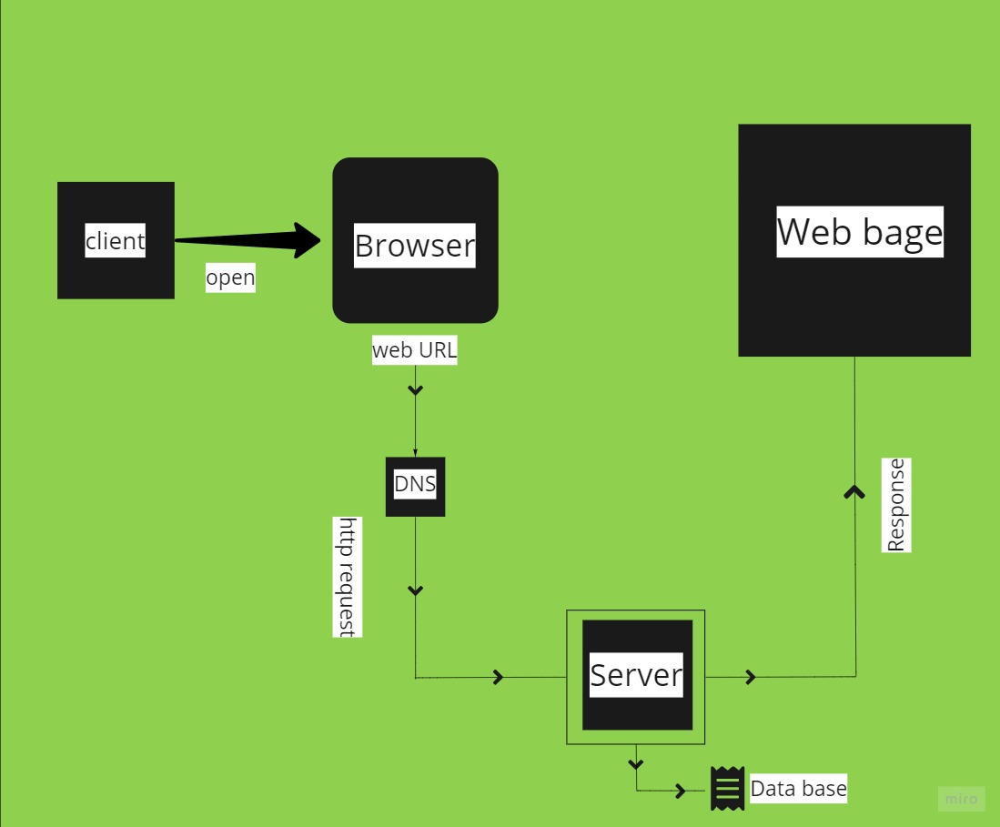

# Movies-Library

# Project Name: movies-library - Project Version : 1.0.0

**Author Name**: Areeg Al-hyari

## WRRC

## Overview

## Getting Started
1- open browser 
2-input URL => localhost:3210 of my app
3-press inter
4-now you in Home Page.

** before you start work on my server, first you have to generate (.env) file and put inside of it your port and your APIKEY fot this API 
## Project Features

