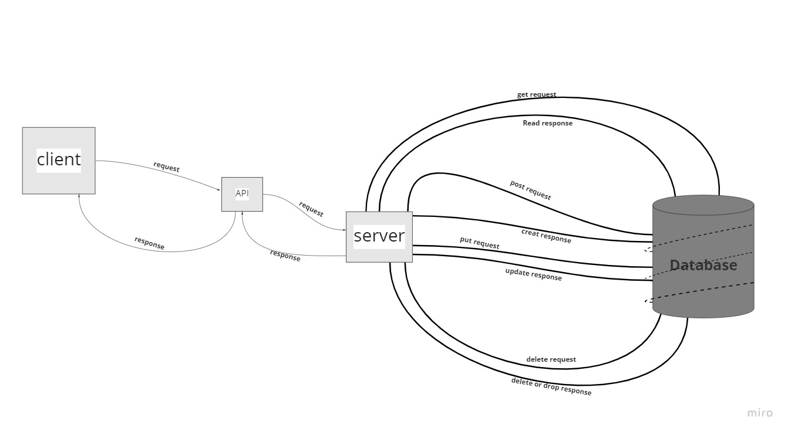

# Movies-Library

# Project Name: movies-library - Project Version : 1.0.0

**Author Name**: Areeg Al-hyari

## WRRC

## Overview

## Getting Started

firstly ,when you want to use my server do npm install.
** before you start work on my server, first you have to generate (.env) file and put inside of it your port and your APIKEY fot this API 
1- open browser 
2-input URL => localhost:3210 of my app
3-now you in Home Page.

## Project Features

you have this rout `/trending` it's take you to trending movie , and if you have to use 
`/search`rout  you have to pass query , now the `/movieToprated` and `/discover` are additional routs if you want extra information about the movies , `/getMovies` that's rout take you to  special movie , if you want to use this end point `/UPDATE/:id` you have to send id that you want to update as aparam and you have to send update data inside the body => request.param.id  , update information you have to send them as an object inside the body , my object contain (title, release_date,poster_path,overview), if you have to use the delete rout `/DELETE/:id` you have to pass param .
